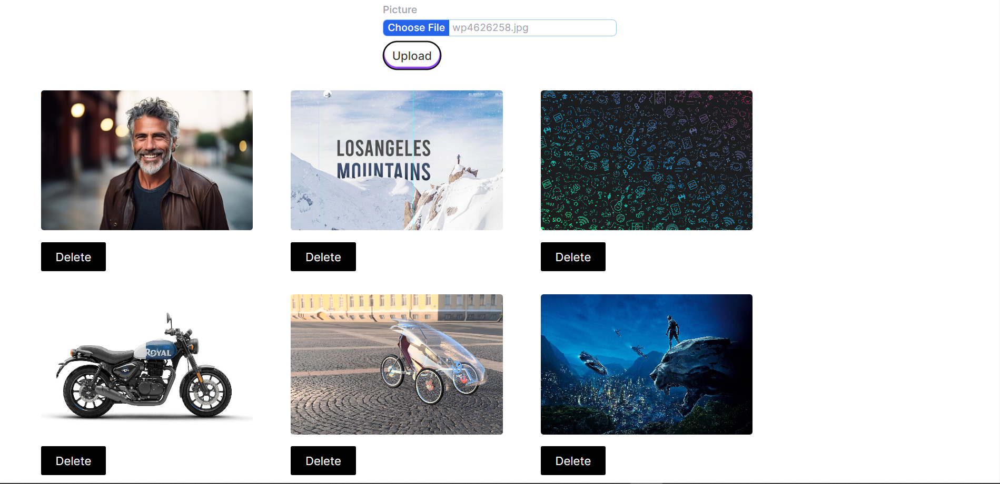
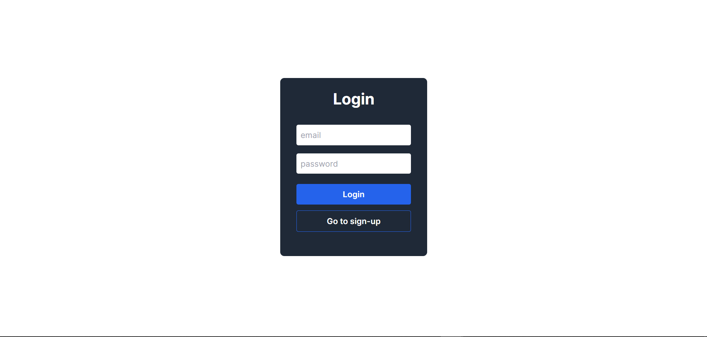
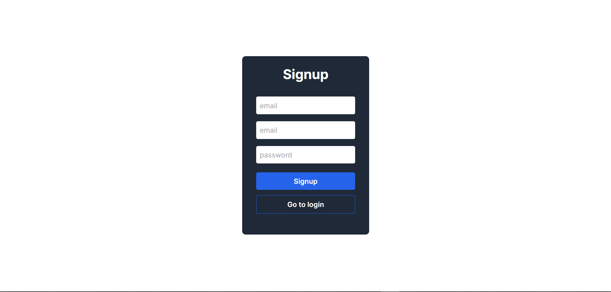

### How to Use

To use the website, simply visit the homepage and create an account. Once you are logged in, you can upload any image you want by pressing upload button. 

Once you have all the images you have uploaded you can see them at your profile page itself.

### Technologies

* Next.js 13
* Typescript
* MongoDB
* React Hot Toast
* Tailwind CSS
* cloudinary

### Technologies Used:

* Next.js 13 for enhanced routing and server-side rendering capabilities.
* MongoDB for efficient and scalable data management.
* React Hot Toast library for real-time notifications, improving user experience.
* Cloudinary to storing the images on cloud and get the url of that images

 ### Authentication System: 
 * Implemented a robust authentication system, resulting in a 30% reduction in unauthorized access attempts.


### How to Contribute
If you would like to contribute to this project, please feel free to fork the repository and submit a pull request.
First, run the development server:


```bash
git clone <link>
npm install
connect to MongoDB server
connect to Cloudinary server
npm run dev
# or
yarn dev
# or
pnpm dev
```